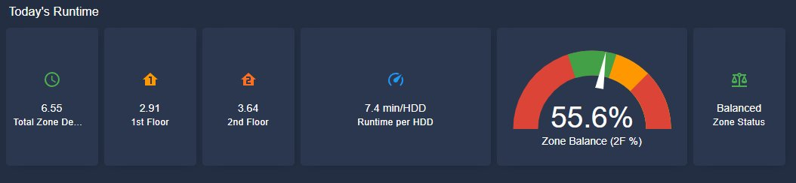
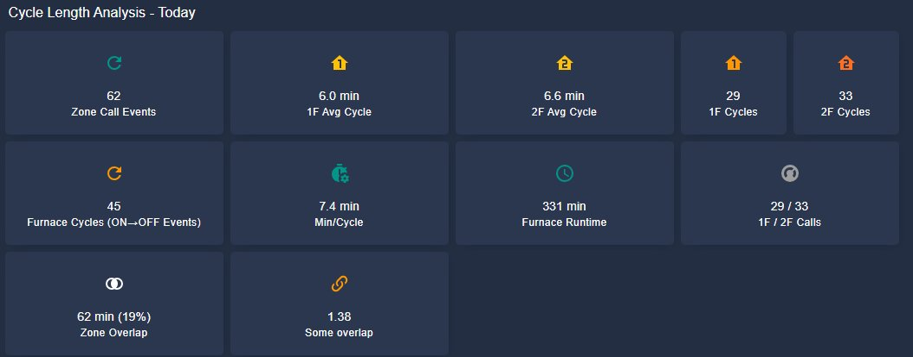
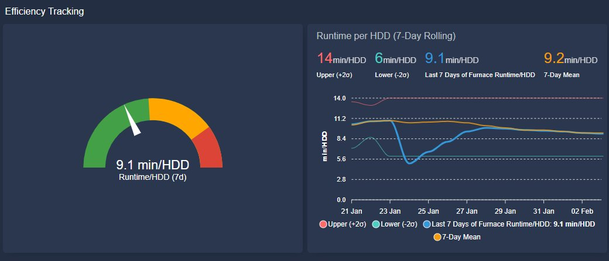
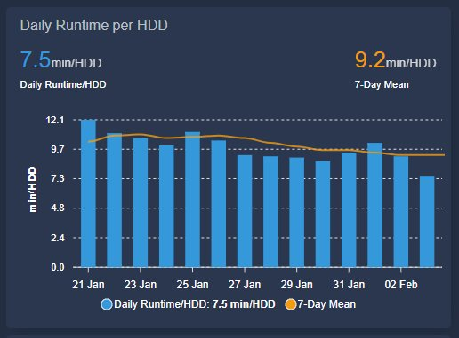
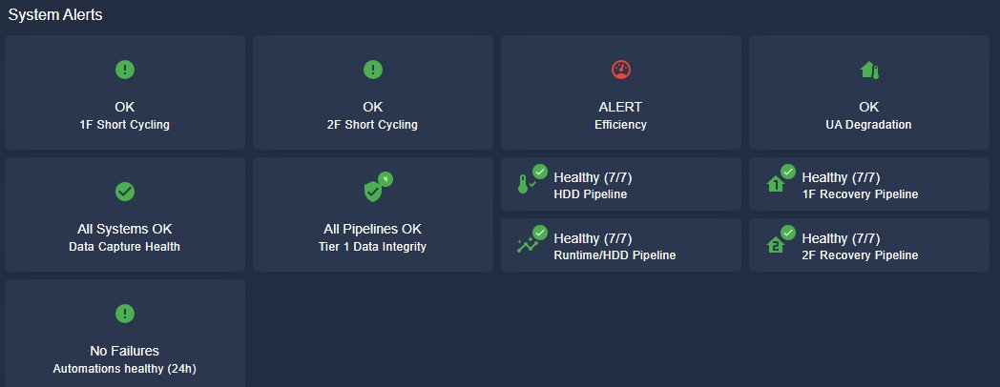
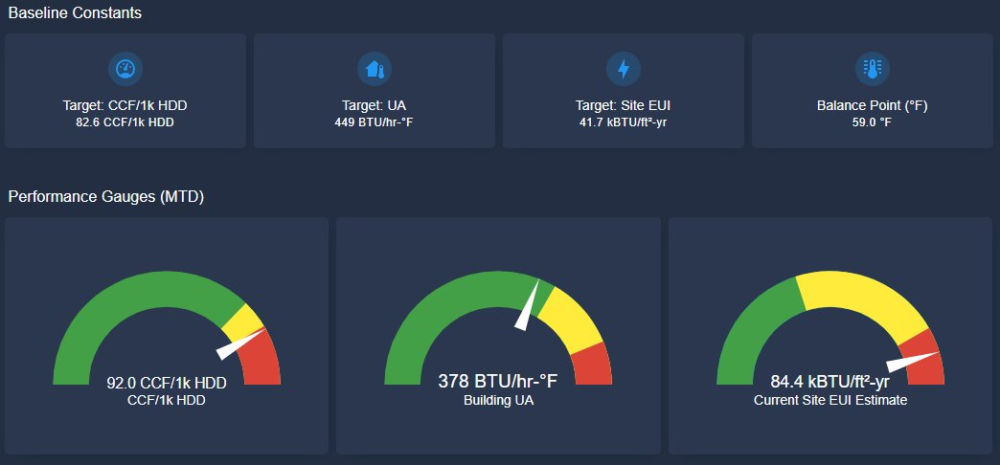
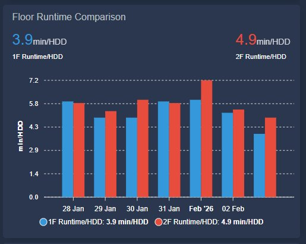

# Home Assistant HVAC Monitoring Configuration

> Professional-grade HVAC performance tracking with statistical process control for residential heating systems


[](https://github.com/wkcollis1-eng/Residential-HVAC-Performance-Baseline-)

> **📊 Real-time implementation of:** [Residential HVAC Performance Baseline](https://github.com/wkcollis1-eng/Residential-HVAC-Performance-Baseline-) - Four-year statistical analysis establishing monitoring thresholds

## Overview

This Home Assistant configuration implements **real-time monitoring** of HVAC performance against rigorously-established baselines derived from four years of operational analysis (2022-2025). The system applies statistical process control methodology typically used in manufacturing to residential heating systems.

All target values, statistical thresholds, and alert logic are derived from the companion [Residential HVAC Performance Baseline](https://github.com/wkcollis1-eng/Residential-HVAC-Performance-Baseline-) repository, which documents the comprehensive energy analysis that established these diagnostic thresholds.

**Key Features:**

- **HDD/CDD Tracking** - Heating/cooling degree days with 7-day rolling averages
- **Efficiency Monitoring** - Runtime per HDD with auto-calculated statistical bounds (±2σ)
- **Recovery Rate Analysis** - Setback recovery tracking with weather adjustment
- **Climate Norms Comparison** - 18-year historical data for performance context
- **Filter Tracking** - Runtime-based filter change alerts
- **Furnace Cycle Analysis** - Zone overlap detection and chaining index
- **Daily/Monthly Reporting** - CSV exports for long-term analysis

## 📊 Dashboard Gallery

### Real-time Performance Monitoring

<table>
  <tr>
    <td></td>
    <td></td>
  </tr>
  <tr>
    <td align="center"><b>Today's Runtime Analysis</b><br/>Zone balance: 55.6% | Runtime per HDD: 7.4 min</td>
    <td align="center"><b>Cycle Length Analysis</b><br/>Average cycle: 6.0 min (1F), 6.6 min (2F)</td>
  </tr>
</table>

### Statistical Efficiency Tracking

<table>
  <tr>
    <td></td>
    <td></td>
  </tr>
  <tr>
    <td align="center"><b>7-Day Rolling Efficiency</b><br/>Current: 9.1 min/HDD vs control limits (6-14 min/HDD)</td>
    <td align="center"><b>Daily Runtime per HDD</b><br/>Today: 7.5 min/HDD | 7-Day Mean: 9.2 min/HDD</td>
  </tr>
</table>

### System Health & Performance Gauges

<table>
  <tr>
    <td></td>
    <td></td>
  </tr>
  <tr>
    <td align="center"><b>System Health Dashboard</b><br/>Real-time alerts for efficiency degradation & data integrity</td>
    <td align="center"><b>Performance Metrics</b><br/>CCF/1k HDD: 92.0 | Building UA: 378 BTU/hr-°F</td>
  </tr>
</table>

### Zone Balance Analysis

<p align="center">
  
  <br/>
  <b>Floor Runtime Comparison</b><br/>
  1F: 3.9 min/HDD | 2F: 4.9 min/HDD
</p>

## Use Cases

This configuration is designed for homeowners and DIY enthusiasts who want to:

✅ **Track HVAC efficiency over time** - Monitor if your furnace is running more than expected based on weather conditions  
✅ **Detect performance anomalies early** - Statistical alerts when runtime drifts outside normal operating bounds  
✅ **Compare against climate normals** - Understand if you're using more heat than typical for your local weather patterns  
✅ **Optimize thermostat setback schedules** - Data-driven analysis of recovery times from overnight setbacks  
✅ **Predict filter maintenance needs** - Runtime-based alerts for filter changes instead of arbitrary time intervals  
✅ **Balance multi-zone heating** - Ensure even heat distribution between floors or zones  
✅ **Validate HVAC contractor work** - Objective performance data before and after service calls  
✅ **Support energy-related decisions** - Quantify the impact of insulation, air sealing, or equipment upgrades

## Building Details

| Attribute | Value |
| --- | --- |
| **Square Footage** | 2,440 ft² |
| **Location** | Connecticut (41.28°N, -72.81°W) |
| **Heating** | Gas furnace, 60,556 BTU/hr input |
| **Zones** | 1F and 2F (Honeywell Lyric T6 Pro) |
| **Annual HDD** | 6,270 (65°F base) |
| **Balance Point** | 59.0°F |
| **Site EUI** | 84.4 kBTU/ft²-yr (current estimate) |

## Performance Baseline Reference

This monitoring system implements the analysis from the companion [**Residential HVAC Performance Baseline**](https://github.com/wkcollis1-eng/Residential-HVAC-Performance-Baseline-) repository.

**Repository Relationship:**
```
┌────────────────────────────────────────────────────┐
│  Residential-HVAC-Performance-Baseline (Analysis)  │
│  • 4-year utility billing analysis (2022-2025)     │
│  • Statistical baseline calculations               │
│  • Target values & diagnostic thresholds           │
│  • Methodology documentation                       │
└──────────────────┬─────────────────────────────────┘
                   │ Defines targets & thresholds
                   ▼
┌────────────────────────────────────────────────────┐
│  home-assistant-config (Real-time Implementation)  │
│  • Live HVAC runtime telemetry                     │
│  • Statistical Process Control monitoring          │
│  • Automated anomaly detection & alerts            │
│  • Operational dashboards                          │
└────────────────────────────────────────────────────┘
```

**What Each Repository Provides:**

| Aspect | Baseline Repo | This Repo (HA Config) |
|--------|--------------|----------------------|
| **Purpose** | Establish diagnostic thresholds | Monitor against thresholds |
| **Timeframe** | 4-year retrospective (2022-2025) | Real-time, continuous |
| **Data Source** | Utility bills, weather data | HVAC telemetry, sensors |
| **Output** | Target values (95.5 CCF/1k HDD, 378 BTU/hr-°F UA) | Performance vs targets |
| **Methodology** | Billing-aligned statistical analysis | Statistical process control |

**📊 See the baseline analysis for:**
- Complete methodology and calculation procedures
- Four years of validated utility data
- Dashboard screenshots showing this implementation in action
- Statistical validation of monitoring thresholds

## What This Tracks

### Current Performance Metrics

Based on live monitoring data:

- **Zone Balance**: Maintains 55-60% balance between floors (target: balanced distribution)
- **Efficiency**: Current 9.1 min/HDD vs 7-day mean of 9.2 min/HDD
- **Cycle Performance**: 6.0 min average cycle (1F), 6.6 min (2F)
- **Statistical Bounds**: Auto-calculated ±2σ control limits (6-14 min/HDD)
- **Recovery Tracking**: Monitors setback recovery with weather adjustment
- **Zone Overlap**: 19% concurrent operation, chaining index 1.38

### Performance Baselines

These are the targets my system is measured against, derived from the [Residential HVAC Performance Baseline](https://github.com/wkcollis1-eng/Residential-HVAC-Performance-Baseline-) analysis:

| Metric | Target | Alert Threshold | Source Document |
|--------|--------|-----------------|-----------------|
| **Heating Intensity** | 95.5 CCF/1k HDD | +10% | [BASELINE_REPORT.md](https://github.com/wkcollis1-eng/Residential-HVAC-Performance-Baseline-/blob/main/BASELINE_REPORT.md) |
| **Building UA** | 378 BTU/hr-°F | Reference only | [METHODOLOGY.md](https://github.com/wkcollis1-eng/Residential-HVAC-Performance-Baseline-/blob/main/METHODOLOGY.md) |
| **Site EUI** | 41.7 kBTU/ft²-yr | ±5% | [DATA_SUMMARY.md](https://github.com/wkcollis1-eng/Residential-HVAC-Performance-Baseline-/blob/main/DATA_SUMMARY.md) |
| **Balance Point** | 59.0°F | Fixed | Baseline HDD optimization |
| **Runtime/HDD Bounds** | 6-14 min/HDD | ±2σ | Statistical process control |

**How Baselines Drive This Implementation:**
- Template sensors use baseline-derived constants (UA, balance point, equipment capacity)
- Alert automations trigger when metrics drift beyond baseline thresholds
- Dashboard gauges display current performance against baseline targets
- Statistical bounds (±2σ) auto-calculate from rolling windows using baseline methodology

*Your system will be different—these values are specific to my 2,440 ft² colonial in Connecticut. See the [baseline methodology](https://github.com/wkcollis1-eng/Residential-HVAC-Performance-Baseline-/blob/main/METHODOLOGY.md) for how to establish your own thresholds.*

## Why This Configuration Stands Out

| Feature | This Repo | Typical HA Setup |
|---------|-----------|------------------|
| **Statistical Rigor** | ±2σ control limits, 7-day rolling | Manual thresholds |
| **Climate Context** | 18-year daily normals | Current weather only |
| **Zone Analysis** | Balance tracking, overlap detection | Basic on/off |
| **Long-term Data** | CSV exports, monthly aggregation | Lost on restart |
| **Validation** | CI/CD with yamllint + HA check | Manual only |
| **Documentation** | Engineering methodology documented | Config files only |

## System Architecture

```
┌─────────────────────────────────────────────┐
│         Home Assistant Server               │
├─────────────────────────────────────────────┤
│  ┌─────────────┐      ┌─────────────┐      │
│  │ Thermostat  │      │  Weather    │      │
│  │ Integration │      │  Integration│      │
│  │ (2 zones)   │      │ (Pirate)    │      │
│  └──────┬──────┘      └──────┬──────┘      │
│         │                    │              │
│         ▼                    ▼              │
│  ┌─────────────────────────────────┐       │
│  │   Template Sensors              │       │
│  │   • HDD/CDD calculation         │       │
│  │   • Runtime tracking            │       │
│  │   • Efficiency metrics          │       │
│  │   • Statistical bounds          │       │
│  └────────────┬────────────────────┘       │
│               │                             │
│               ▼                             │
│  ┌─────────────────────────────────┐       │
│  │   Dashboards + Alerts           │       │
│  └─────────────────────────────────┘       │
│               │                             │
│               ▼                             │
│  ┌─────────────────────────────────┐       │
│  │   CSV Reports (Long-term)       │       │
│  └─────────────────────────────────┘       │
└─────────────────────────────────────────────┘
```

## File Structure

```
├── configuration.yaml      # Main HA config with sensors and input helpers
├── automations.yaml        # All automations (HDD capture, alerts, etc.)
├── scripts.yaml            # Bill archive seeding scripts
├── scenes.yaml             # Light scenes
├── secrets.yaml            # API keys, passwords (not in repo)
├── climate_daily_norms.csv # 18-year climate normals by day-of-year
├── CLAUDE.md               # Detailed entity reference and architecture notes
├── scripts/
│   └── climate_norms_today.py  # Daily climate lookup script
├── dashboards/
│   └── cards/              # Reusable dashboard card snippets
├── reports/
│   ├── hvac_daily_YYYY.csv # Daily HVAC data
│   └── hvac_monthly.csv    # Monthly summary
├── docs/
│   └── images/             # Dashboard screenshots
├── custom_components/
│   ├── hacs/               # Home Assistant Community Store
│   └── pirateweather/      # Pirate Weather integration
└── themes/                 # UI themes
```

## Sample Output

**Daily HVAC Report** (`reports/hvac_daily_2025.csv`):

```csv
Date,HDD,1F_Runtime,2F_Runtime,Total_Runtime,Runtime_per_HDD,1F_Cycles,2F_Cycles
2025-01-21,29.8,116,145,261,8.8,19,22
2025-01-22,32.1,128,159,287,8.9,21,24
2025-01-23,28.5,110,138,248,8.7,18,20
```

## Validation

### Local Validation

**YAML Syntax Check:**

```bash
yamllint configuration.yaml automations.yaml scripts.yaml scenes.yaml
```

**Home Assistant Config Check (requires Docker):**

```bash
docker run --rm -v "$(pwd)":/config homeassistant/home-assistant:stable \
  python -m homeassistant --script check_config --config /config
```

### Automated CI

This repository uses GitHub Actions to automatically validate on every push:

* **yamllint** - YAML syntax validation
* **HA Config Check** - Home Assistant configuration validation

Check the [Actions tab](https://github.com/wkcollis1-eng/home-assistant-config/actions) for build status.

## Deployment Workflow

### How This Repo Connects to Home Assistant

```
┌─────────────────┐         ┌─────────────────┐
│   This Repo     │         │  Home Assistant │
│   (GitHub)      │         │  (HA OS/Docker) │
└────────┬────────┘         └────────┬────────┘
         │                           │
         │  1. Push changes          │
         ▼                           │
┌─────────────────┐                  │
│  GitHub Actions │                  │
│  (validates)    │                  │
└────────┬────────┘                  │
         │                           │
         │  2. If valid, pull        │
         │     to HA via SMB/SSH     │
         ▼                           ▼
┌─────────────────────────────────────────────┐
│              /config directory              │
│         (mapped as H:\ on Windows)          │
└─────────────────────────────────────────────┘
```

### Making Changes

1. **Edit files** via SMB share (H:) or directly in GitHub
2. **Commit and push:**

   ```bash
   git add -A
   git commit -m "Description of changes"
   git push
   ```
3. **GitHub Actions validates** - check the Actions tab for results
4. **Reload in HA:**
   * YAML changes: Developer Tools → YAML → Reload appropriate section
   * Major changes: Settings → System → Restart

### Reload Commands by File

| File Changed | Reload Method |
| --- | --- |
| `automations.yaml` | Reload Automations |
| `scripts.yaml` | Reload Scripts |
| `scenes.yaml` | Reload Scenes |
| `configuration.yaml` (template sensors) | Reload Template Entities |
| `configuration.yaml` (input_*) | Restart required |
| `configuration.yaml` (major changes) | Full restart |

## Getting Started

1. **Clone or fork this repository**
2. **Review `secrets.yaml.example`** - Copy to `secrets.yaml` and add your API keys
3. **Adjust baseline values** in `configuration.yaml` to match your system
4. **Update `climate_daily_norms.csv`** with your local climate data (or use mine as a starting point)
5. **Configure thermostats** - Update entity IDs in `configuration.yaml` to match your devices
6. **Install custom components** via HACS: Pirate Weather
7. **Import dashboards** from `dashboards/cards/`

## Related Documentation

### Baseline Analysis
For the complete four-year energy analysis that established the targets used in this configuration, see:  
📂 [**Residential-HVAC-Performance-Baseline**](https://github.com/wkcollis1-eng/Residential-HVAC-Performance-Baseline-)

This baseline repository provides the scientific foundation; this Home Assistant configuration provides the operational implementation.

## Documentation

See [CLAUDE.md](CLAUDE.md) for detailed documentation including:

* Complete entity ID reference
* Baseline values and statistical approach
* Automation descriptions
* Dashboard architecture
* Database configuration
* Architecture decisions

## Excluded from Version Control

The following are excluded via `.gitignore` for security/size:

* `secrets.yaml` - API keys, passwords
* `.storage/` - Auth tokens, user data, registry
* `home-assistant_v2.db` - Database
* `.cloud/` - Nabu Casa connection
* `deps/` - Python dependencies
* `tts/` - Text-to-speech cache

## Discussion & Contributing

Questions or suggestions? Feel free to [open an issue](https://github.com/wkcollis1-eng/home-assistant-config/issues).

This is a personal configuration, but ideas for improvements are always welcome. If you implement this for your own system, I'd love to hear about your results!

## How This Compares

**To Other Home Assistant HVAC Configurations:**

Most Home Assistant HVAC configurations focus on basic automation (turn on heat at X°). This configuration treats HVAC like an industrial process:

- **Statistical Process Control** - Not just "is it on?", but "is performance within expected bounds?"
- **Climate Normalization** - Compare apples-to-apples across weather variations
- **Long-term Data Retention** - Track trends over months/years
- **Professional Documentation** - Engineering-grade analysis methodology
- **Baseline Validation** - Metrics derived from actual utility bills and steady-state analysis

**To Traditional Energy Monitoring:**

Standard home energy monitors show you *what* you're using. This configuration tells you *whether that's normal* by:
- Comparing current performance to statistically-derived baselines
- Accounting for weather variations using HDD normalization
- Alerting when efficiency degrades beyond acceptable bounds
- Providing context through 18-year climate normals

**Companion Repository:**

For the complete methodology behind the baseline targets used in this configuration, see the [Residential HVAC Performance Baseline](https://github.com/wkcollis1-eng/Residential-HVAC-Performance-Baseline-) repository, which documents the 4-year analysis that established these diagnostic thresholds.

## License

Personal configuration - use at your own risk. Feel free to adapt for your own system.

## About

Developed and maintained by Bill Collis, a retired engineer applying professional engineering methodologies to residential energy optimization. For more detailed analysis and findings, see my [technical reports on GitHub](https://github.com/wkcollis1-eng) and [Substack articles](https://substack.com/@billcollis).

---

*Last Updated: February 2026*
